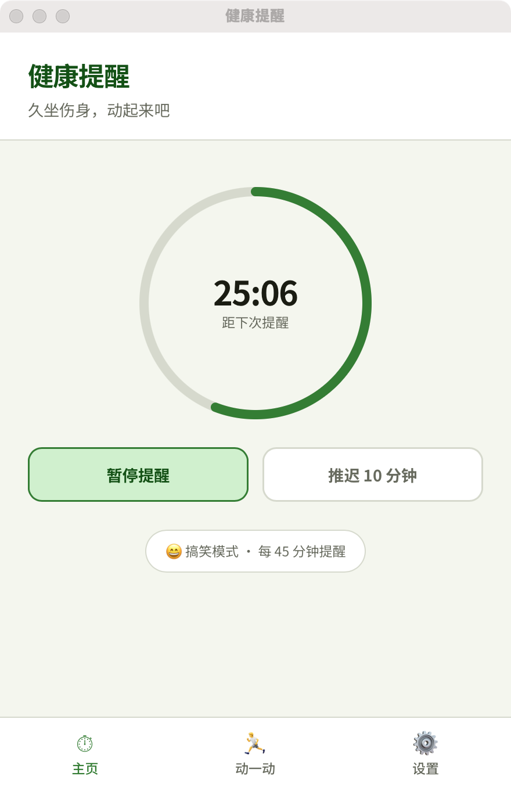
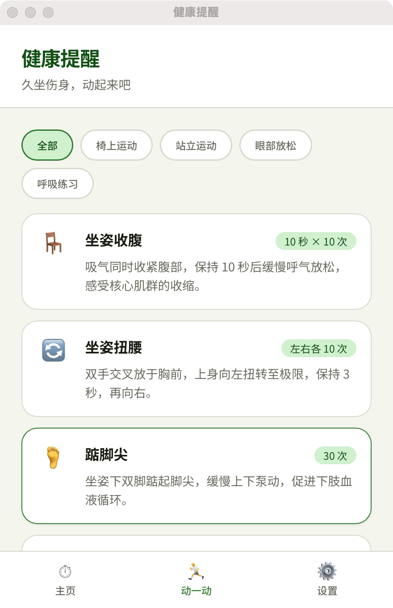
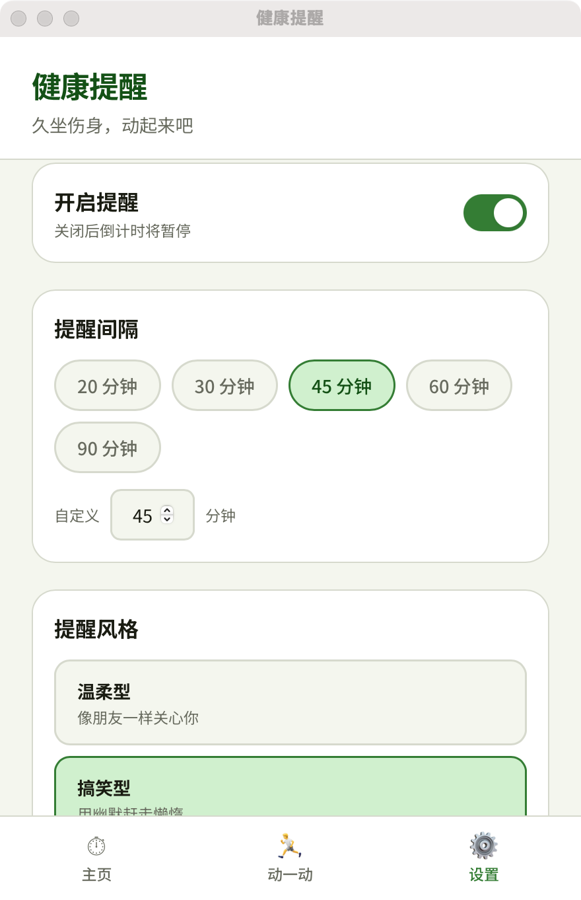

# 健康提醒 🌿

> 专为久坐办公室人群设计的温情健康提醒工具

长时间盯着屏幕，腰椎在抗议，眼睛在罢工？健康提醒会在对的时间轻轻推你一把——起来动一动吧。

## 预览

### 菜单栏实时倒计时


> 常驻菜单栏，随时看到距下次提醒还有多久，不用打开窗口。

### 主页



### 运动库



### 设置



## 功能特点

- **菜单栏倒计时** — 实时显示距下次提醒的剩余时间，鼠标悬停查看精确到秒
- **温情系统通知** — 3种风格随你选：温柔陪伴 / 搞笑整蛊 / 简洁严肃
- **运动库** — 14个动作，覆盖椅上运动、站立运动、眼部放松、呼吸练习
- **灵活设置** — 提醒间隔 1-120 分钟自由调整，支持免打扰时段
- **推迟功能** — 忙的时候一键推迟 10 分钟
- **常驻后台** — 关闭窗口只是隐藏，提醒不中断；托盘菜单可彻底退出
- **跨平台** — 支持 macOS 和 Windows

## 下载安装

前往 [Releases](../../releases) 页面下载最新版本：

| 平台 | 文件 |
|------|------|
| macOS (Apple Silicon) | `健康提醒_x.x.x_aarch64.dmg` |
| macOS (Intel) | `健康提醒_x.x.x_x64.dmg` |
| Windows | `健康提醒_x.x.x_x64-setup.exe` |

> macOS 首次打开时若提示「无法验证开发者」，请右键点击 App → 打开。

## 本地开发

### 环境要求

- [Node.js](https://nodejs.org/) 18+
- [Rust](https://rustup.rs/) 1.70+
- [Tauri 前置依赖](https://tauri.app/start/prerequisites/)

### 启动开发模式

```bash
git clone https://github.com/acowbo/health-reminder.git
cd health-reminder
npm install
npm run tauri dev
```

### 打包

```bash
npm run tauri build
```

产物在 `src-tauri/target/release/bundle/` 目录下。

## 技术栈

- **前端**: React 19 + TypeScript + Vite
- **后端**: Rust + Tauri 2
- **通知**: 系统原生通知 API

## License

MIT
